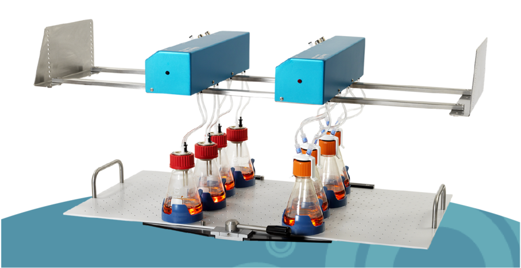
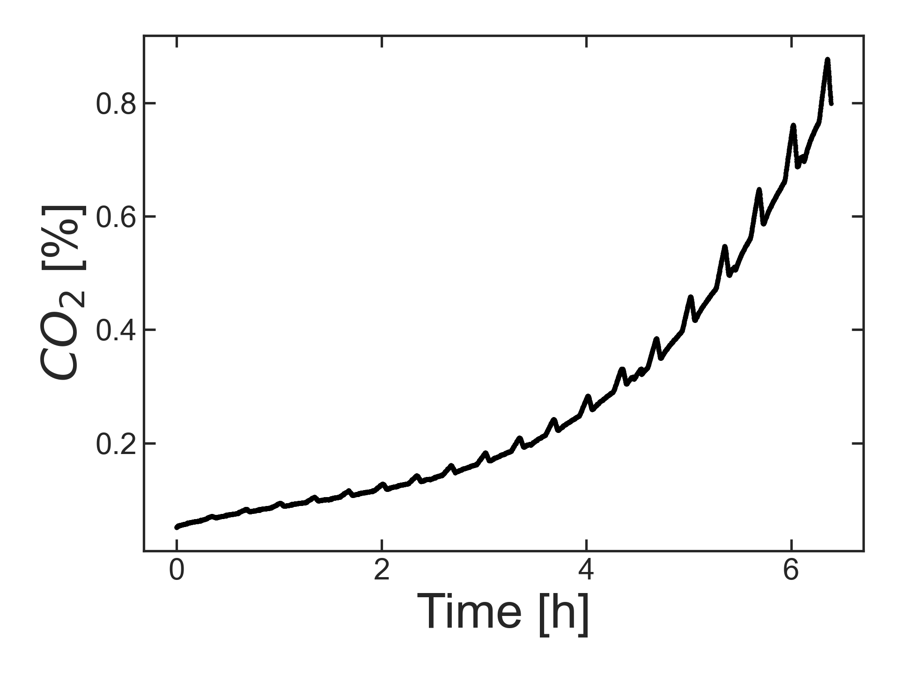
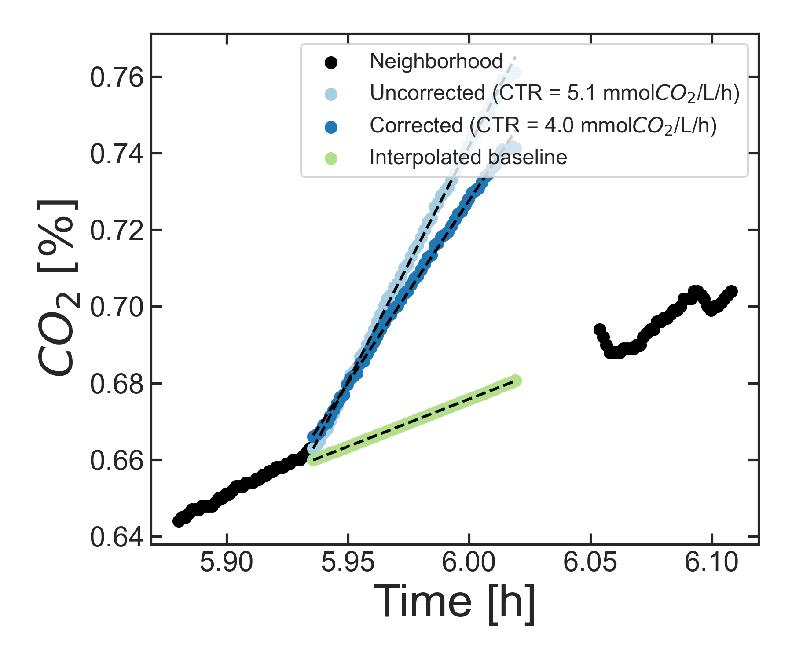

# CTR-correct

## Background
To follow the growth and metabolic activity of cells in liquid cultures, one can use a TOM-device (Kuhner). These flasks are closed off from the atmosphere, but are connected to tubes for in- and outflow of air. Importantly, the outflowing air is passed through a control box that contains sensors for CO2 and O2. 

The principle for the measurement of the *rates* of CO2 excretion and O2 uptake by cells growing inside each flask is very simple:
 every few minutes, the inflow and outflow of air stops. During this period, the CO2 released by the cells accumulates in the headspace, which the detector "sees" as a sharp increase in the concentration of CO2. Conversely, the amount of O2 in the headspace decreases sharply during the same period, as the cells consume it (phase II in the figure below):

 
 (*Fig. 1 from Ihling et al (2021)*)

From the slope of this increase/decrease of gas concentration, we determine the volumetric rates of CO2 and O2 transfer (i.e., per volume of liquid). These parameters are called CTR and OTR, respectively.

After this short measurement period, the air flow resumes and the CO2 and O2 concentrations should return to their initial values.

## Problem 
The way the CTR and OTR are calculated assumes that the baseline concentration of CO2 and O2 is constant. However, if the cells grow fast and release/consume more of these two gases than can be removed/supplied from the headspace, then this assumption no longer holds: instead of a constant baseline, the concentration of the two gases changes strongly with time. Here is one such example where the CO2 concentration is definitely not constant:

(*note that the "peaks" of CO2 concentration correspond to the periods where the CTR is being measured*)

## Solution
To determine CTR values that are not affected by a changing baseline, the approach we will follow is as follows:
1. Identify all the "peaks" of CO2, corresponding to the CTR measurements
2. Define a small region just before and just after each peak (i.e. "Neighborhood")
3. Use the CO2 concentrations in the "Neighborhood" to interpolate the values of the baseline during the measurement period
4. Subtract this variable baseline from the peak
5. Calculate the corrected CTR as the slope of the corrected peak

